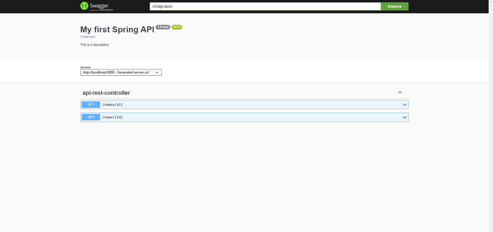
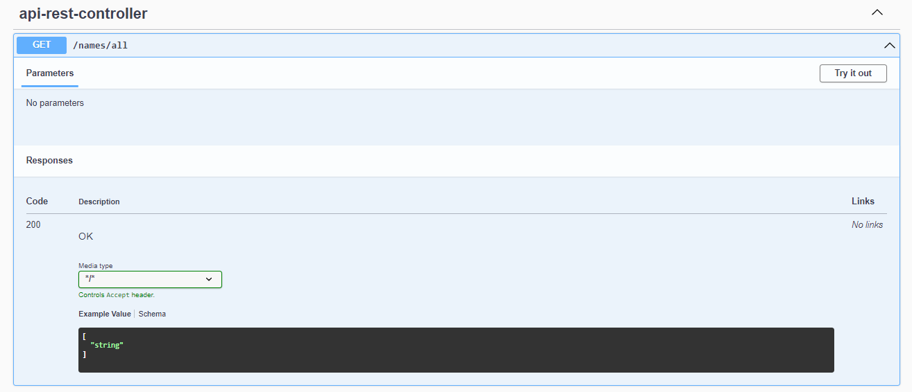
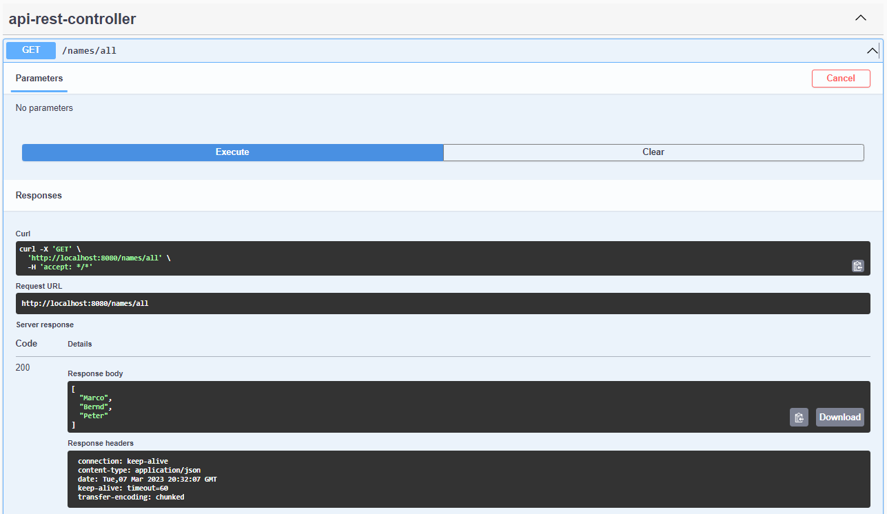
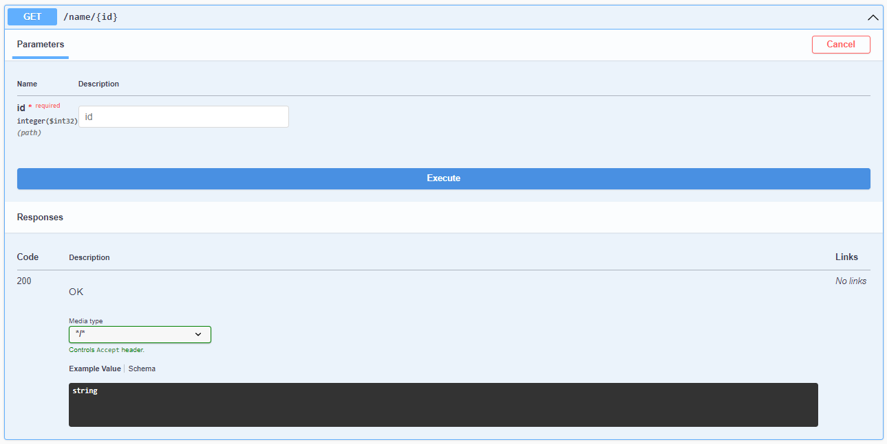
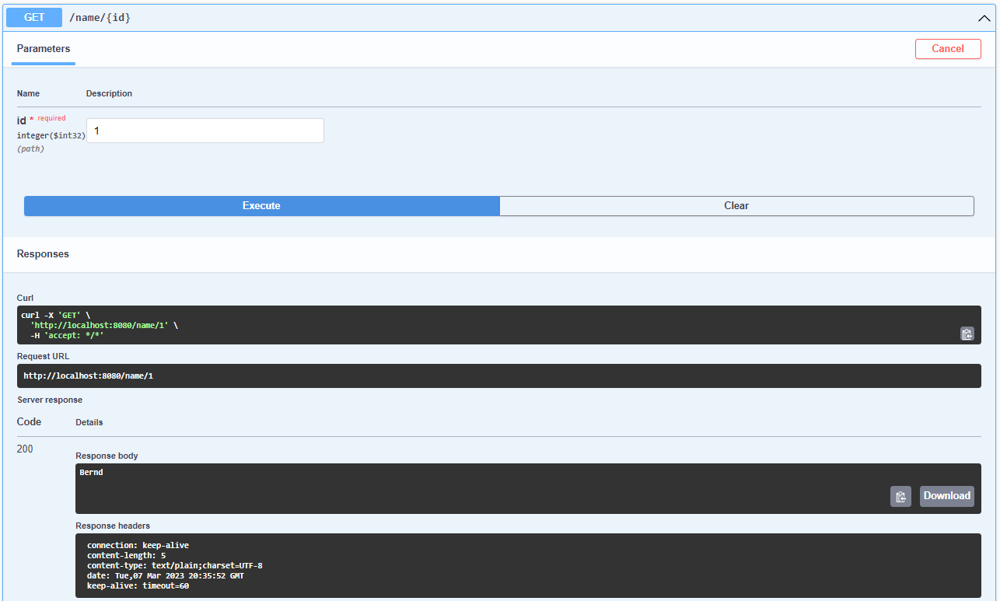
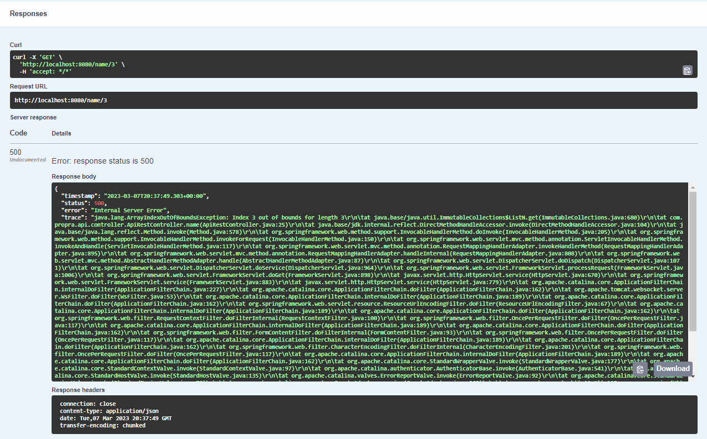

:toc:

# Spring Boot OpenAPI example:

This repository contains a basic example, which demonstrates how to use OpenAPI and SwaggerUI with Spring Boot.

## Dependency

To use OpenAPI and SwaggerUI inside of your Spring Boot project, you have to add the following dependency to your `build.gradle` or `pom.xml`:

#### Maven

Add this to your `pom.xml`:

```xml
   <dependency>
      <groupId>org.springdoc</groupId>
      <artifactId>springdoc-openapi-ui</artifactId>
      <version>1.6.14</version>
   </dependency>
```

#### Gradle

Add this to your `build.gradle`:

```groovy
'org.springdoc:springdoc-openapi-ui:1.6.14'
```

## Usage:

To use OpenAPI and SwaggerUI inside of your project, you will have to setup a configuration, which will serve a bean of the type `OpenAPI`.

```java
@Configuration
public class APIConfiguration {

    @Bean
    public OpenAPI setupAPI() {
        return new OpenAPI()
                .info(new Info()
                    .title("My first Spring API")
                    .version("1.0 test")
                    .description("This is a description"));
    }
}
```

After setting up your configuration, you have to setup a restcontroller.

```java
@RestController
public class ApiRestController {

    private final List<String> names;

    public ApiRestController() {
        this.names = List.of("Marco", "Bernd", "Peter");
    }

    @GetMapping("/names/all")
    public List<String> names() {
        return this.names;
    }

    @GetMapping("/name/{id}")
    public String name(@PathVariable Integer id) {
        return this.names.get(id);
    }
}
```

The shown controller offers two routes, `/names/all` and `/name/{id}` respectively.

The route `/names/all` returns all of the names with the return type `List<String>`. The second route `/name/{id}`
uses an id as pathvariable and returns the `n-th` person from the list of names.

#### Swagger UI

##### 1. Route without parameter

You can access the webinterface of SwaggerUI via the route `/swagger-ui`. On this page you will find the previously created information about your OpenAPI. It attaches to your webapplication and
displays the currently available routes and the HTTP verb.



You can use SwaggerUI to get information about the route, like in the following image:



As you can see, you get information about parameters and also about the response of the route. It explains the status codes and an example value.

In the top you will find a button with the label `Try it out`. After clicking this button, a prompt will occur in which you can send a test request to the route.



After hitting the button `Execute` the request will be performed and you will see an example for an API-call via `curl` and also the request URL.

You will also see the status code, the response body and the response headers.

##### 2. Route with parameter

The following image shows the presentation of a route with parameters in SwaggerUI.



In the top of the view you are able to enter a value for the parameter. After hitting `Execute` you will receive the result. The following image shows the result:



The image shows the `curl` command and the request URL and also the response body and headers, as in the previous example.

If you now send an invalid value for the parameter `id`, you will receive the following result:



If the API runs into an error, you will see the status code `500` and also receive the stack-trace of your Spring Boot application.
